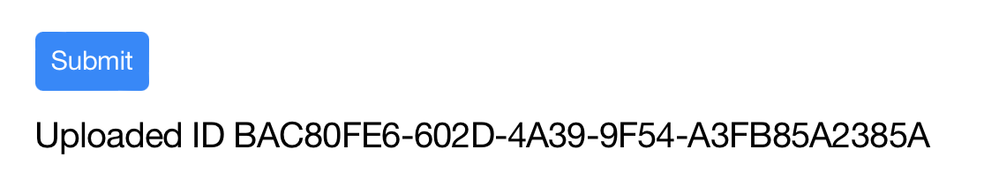
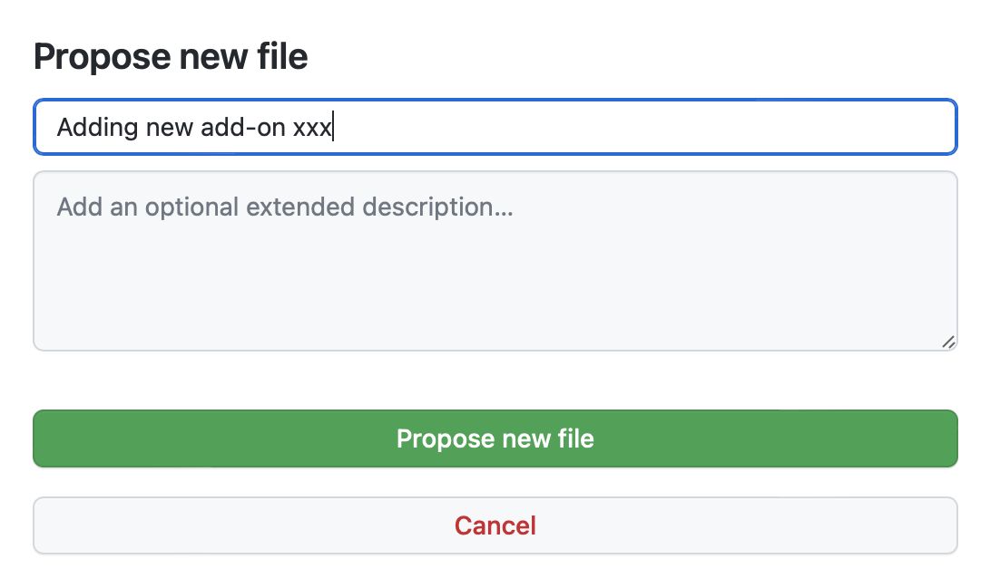
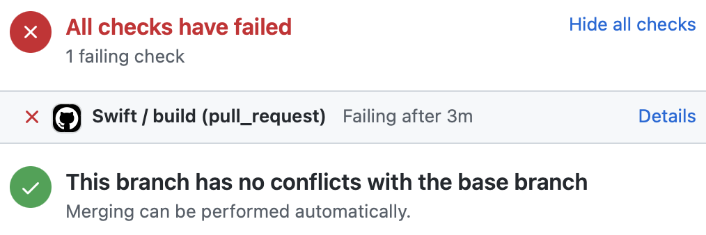
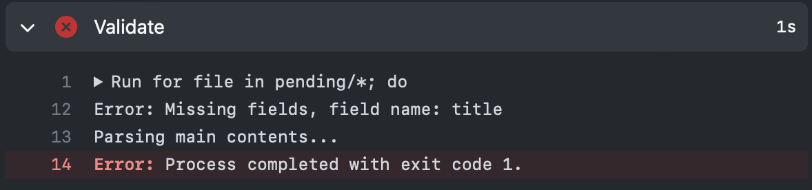

# Upload Celestia Add-ons

## Fill in the information

Go to [this page](https://celestia.mobi/update-addon) and fill in the information about this add-on you are adding, changing or removing.

The page depends on Apple service, so you might need to register an Apple ID.

After clicking the submit button, your change will be uploaded. If it is successful, get the change ID.

In this example, the change ID is `BAC80FE6-602D-4A39-9F54-A3FB85A2385A`.

## Create a pull request for validation

Open [this page](https://github.com/levinli303/celestia-addon-validator/tree/main/pending), click `Add file`, then `Create new file`, for the file name, fill in the change ID you get earlier, leave the file content empty.

Scroll down, fill in the title and click `Propose new file`.

In the new page opened, click `Create pull request`.

Validation should begin automatically. However if it is the first time you contribute to this repository, you might need approval to get the validation started.

## Check validation result

Validation should only take a few minutes.

If validation fails, it will appear like this.

Click `Details`, and see where it goes wrong.

In this example, `title` is missing in submitting a new add-on. If it fails, Click `Close pull request` and start from the beginning.

## Upload to celestia.mobi

After it passes validation, a collaborator can merge this pull request. After the pull request is merged, more checks will be performed automatically and the add-on will be uploaded to celestia.mobi.