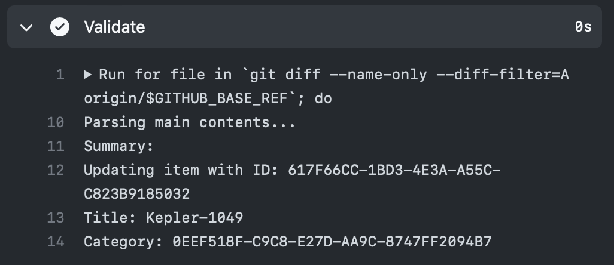

# Upload Celestia Add-ons

## Fill in the information

Go to the [Update Addon](https://celestia.mobi/submit-addon) page and fill in the information about this add-on you are adding, changing or removing.

You can submit add-ons by itself or signing in with an Apple ID or GitHub account. It is highly recommended to **_UPLOAD ADD-ONS WITH A GITHUB ACCOUNT SIGNED_**

After clicking the submit button, your change will be uploaded. 

## Submitting Addons with a GitHub Account

For GitHub submissions, two pop-up windows will appear. On its first pop-up, simply enter the title of the addon you submitted

The second pop-up window is optional. State the changes you made on the addon's update on this window. Simply click `OK` if it is an entirely new addon submitted

The page will then automatically create a PR for you once the two pop-up windows are successfully filled up. Proceed to [Check Validation Result](https://github.com/celestiamobile/celestia-addon-validator/README.md#check-validation-result) for the next steps

## Submitting Addons with an Apple ID and/or Direct Submission

On Apple ID/Direct submissions, the screenshot below will appear. If it is successful, get the change ID.

In this example, the change ID is `BAC80FE6-602D-4A39-9F54-A3FB85A2385A`.

## Create a pull request for validation
_(NOTE: For Apple ID/Direct Submissions only)_

Open [this page](https://github.com/levinli303/celestia-addon-validator/tree/main/pending), click `Add file`, then `Create new file`, for the file name, fill in the change ID you get earlier, leave the file content empty.

Scroll down, fill in the title and click `Propose new file`.

In the new page opened, click `Create pull request`.

Validation should begin automatically. However if it is the first time you contribute to this repository, you might need approval to get the validation started.

## Check validation result

Validation should only take a few minutes.

If validation fails, it will appear like this.

Click `Details`, and see where it goes wrong.

In this example, `title` is missing in submitting a new add-on. If it fails, Click `Close pull request` and start from the beginning.

In a successful validation, a summary will be displayed in details.

## Upload to celestia.mobi

After it passes validation, a collaborator can merge this pull request. After the pull request is merged, more checks will be performed automatically and the add-on will be uploaded to celestia.mobi.

## ZIP format

GitHub does not allow uploading files to repositories directly on web. If you know how to create a pull request without web interface then create a pull request putting the zip file under `pending_zip` directory.
